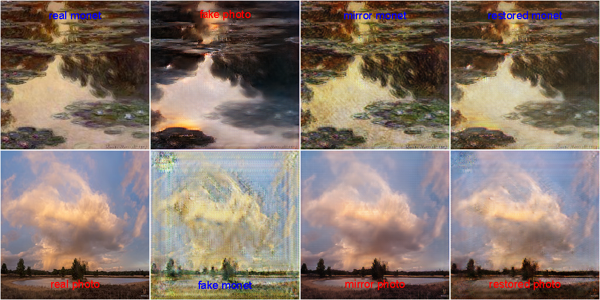

CycleGAN in MxNetR
===

This is a simple example for implementing the CycleGAN by MxNetR. The idea is devoloped by **[this paper](https://arxiv.org/abs/1703.10593)**, and related details can be found in this [project](https://junyanz.github.io/CycleGAN/). This is a simple example for MxNetR user, I will use a relatively small dataset for demonstrating how it work. 

Note: this is an example for implementing CycleGAN generated Monet paintings from photos. The dataset is released by [junyanz/CycleGAN](https://github.com/junyanz/CycleGAN), and you can download it from [https://people.eecs.berkeley.edu/~taesung_park/CycleGAN/datasets](https://people.eecs.berkeley.edu/~taesung_park/CycleGAN/datasets).

# The principle of CycleGAN

The CycleGAN architecture is showed as following. The nice explanation by Hardik Bansal and Archit Rathore, with Tensorflow code documentation ([Understanding and Implementing CycleGAN](https://hardikbansal.github.io/CycleGANBlog/)). The only thing the blog doesn’t mention is 'identity mapping loss'. So the revised architecture need to include this loss.

  

The identity mapping loss helps preserve the color of the input paintings. For example, this photo is the input as following:

  

If the CycleGAN does not include identity mapping loss, after 50 epoch, even though he has performed quite well, but it will cause conversion distortion.

  

If we revise the CycleGAN and include identity mapping loss, after 50 epoch, it will perform well.

  

More interestingly, we can also process this image again through the photo2monet model as following.

  

One more!

  

# If you just want to use this model.

You can use the code ["1. Photo2Monet.R"](https://github.com/xup6fup/MxNetR-CycleGAN/blob/master/code/3.%20Use%20model/1.%20Photo2Monet.R) for processing a photo. Here we prepared a well-trained model for your experiment. The 'P2M_gen_v1-0000.params' and 'P2M_gen_v1-symbol.json' can be found in the folder 'well trained model'. This is a CycleGAN trained without identity mapping loss. The version 2 model is to use the identity mapping loss for training. You can find 'P2M_gen_v2-0000.params' and 'P2M_gen_v2-symbol.json'. Here we use the 'input_photo.png' for testing the model.

# If you want to train a CycleGAN.

Download dataset and pre-processing
---

[junyanz/CycleGAN](https://github.com/junyanz/CycleGAN) provides a monet2photo dataset and it can be download from [https://people.eecs.berkeley.edu/~taesung_park/CycleGAN/datasets](https://people.eecs.berkeley.edu/~taesung_park/CycleGAN/datasets). I will use this website for downloading this dataset. You can use the code ["1. Download monet2photo.R"](https://github.com/xup6fup/MxNetR-CycleGAN/blob/master/code/1.%20Processing%20data/1.%20Download%20monet2photo.R) to quickly download this dataset (291 MB). **Note: if you just want to use well-trained model, you don't need to download this dataset.**

The all images in this dataset have been resized to 256×256. For further use this dataset, I provide the codes ["2-1. Pre-processing image (train).R"](https://github.com/xup6fup/MxNetR-CycleGAN/blob/master/code/1.%20Processing%20data/2-1.%20Pre-processing%20image%20(train).R) and ["2-2. Pre-processing image (test).R"](https://github.com/xup6fup/MxNetR-CycleGAN/blob/master/code/1.%20Processing%20data/2-2.%20Pre-processing%20image%20(test).R) to do this work. Resized images will be converted as .RData and they totally used about 266.7 MB for training and 28.8 MB for testing for storing them. 

Training stage
---

The first step for using MxNet to train a CycleGAN is to build an iterator. You can use the codes ["1. Parameters & Iterator.R"](https://github.com/xup6fup/MxNetR-CycleGAN/blob/master/code/2.%20Training%20process/1.%20Parameters%20%26%20Iterator.R) for conducting this process. 

The next step is to define the model architecture. The code ["2. Model architecture.R"](https://github.com/xup6fup/MxNetR-CycleGAN/blob/master/code/2.%20Training%20process/2.%20Model%20architecture.R) includes **Generator_symbol**, **Discriminator_symbol**, **adversarial_loss**, **cycle_consistency_loss**, and **identity_mapping_loss**. It is worth noting that I use the WGAN loss to train this CycleGAN, you can change the loss function becasue it is not very important.

Before the training, we need to build optimizer and executor, you can find them in the code ["3. Optimizer, Executor & Updater.R"](https://github.com/xup6fup/MxNetR-CycleGAN/blob/master/code/2.%20Training%20process/3.%20Optimizer%2C%20Executor%20%26%20Updater.R). Finally, we can training it in the code ["4. Training loop.R"](https://github.com/xup6fup/MxNetR-CycleGAN/blob/master/code/2.%20Training%20process/4.%20Training%20loop.R). It is worth noting that we can design the training parameters from ["5-1. Training (CycleGAN_v1).R"](https://github.com/xup6fup/MxNetR-CycleGAN/blob/master/code/2.%20Training%20process/5-1.%20Training%20(CycleGAN_v1).R) and ["5-2. Training (CycleGAN_v2).R"](https://github.com/xup6fup/MxNetR-CycleGAN/blob/master/code/2.%20Training%20process/5-2.%20Training%20(CycleGAN_v2).R).

Use the model
---

The code ["1. Photo2Monet.R"](https://github.com/xup6fup/MxNetR-CycleGAN/blob/master/code/3.%20Use%20model/1.%20Photo2Monet.R) can be used to process a photo, and the demonstration is show as above. If you want to get this parameters and further usage, you can use the code ["2. Save model parameters.R"](https://github.com/xup6fup/MxNetR-CycleGAN/blob/master/code/3.%20Use%20model/2.%20Save%20model%20parameters.R) to save them. If you want to visualized the model performance, you can use the code ["3. Plot a specific image.R"](https://github.com/xup6fup/MxNetR-CycleGAN/blob/master/code/3.%20Use%20model/3.%20Plot%20a%20specific%20image.R). And this is the result of CycleGAN_v1 (without identity mapping loss):

  

This is the result of CycleGAN_v2 (with identity mapping loss):

  

CycleGAN is a very cool model, let's try it!
